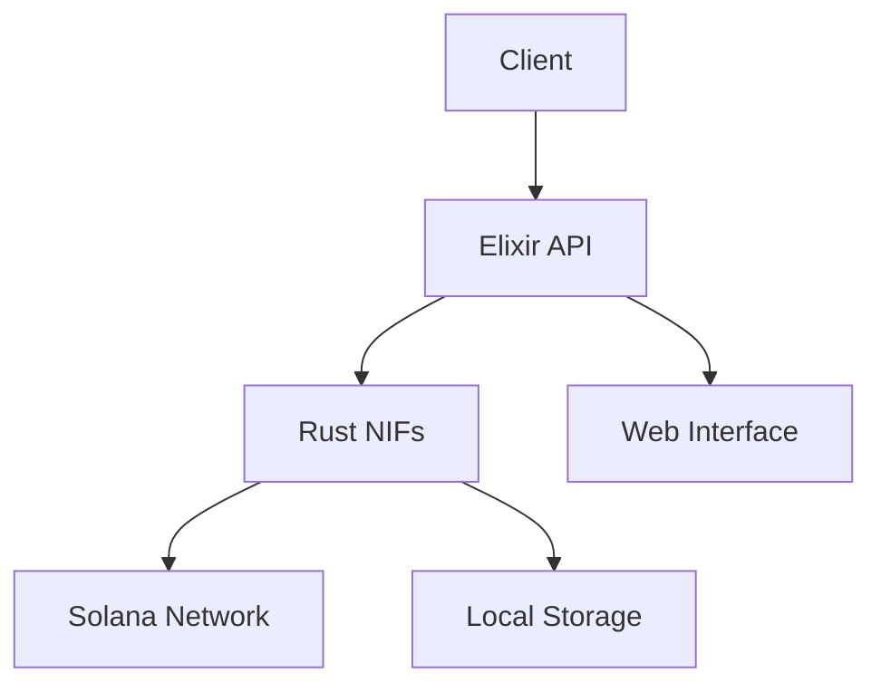

# BubblegumNif

Native Implemented Functions (NIFs) for Metaplex Bubblegum compressed NFTs on Solana.

## Features

- Create and manage compressed NFT merkle trees
- Mint compressed NFTs
- Transfer compressed NFTs
- Delegate authority over compressed NFTs
- Redeem and decompress NFTs
- Compress existing NFTs
- Persistent storage for tree states
- Transaction simulation and retry mechanisms
- Account derivation for all PDAs
- Web interface for all operations

## Installation

Add `bubblegum_nif` to your list of dependencies in `mix.exs`:

```elixir
def deps do
  [
    {:bubblegum_nif, "~> 0.1.0"}
  ]
end
```

## Requirements

- Erlang/OTP 24 or later
- Elixir 1.14 or later
- Rust 1.70 or later
- Solana CLI tools

## Setup

1. Install Rust and Cargo:
```bash
curl --proto '=https' --tlsv1.2 -sSf https://sh.rustup.rs | sh
```

2. Install Solana CLI tools:
```bash
sh -c "$(curl -sSfL https://release.solana.com/v1.17.0/install)"
```

3. Create a Solana wallet for testing:
```bash
solana-keygen new --outfile ~/.config/solana/devnet.json
```

4. Configure Solana for devnet:
```bash
solana config set --url https://api.devnet.solana.com
```

## Usage

### Initialize Client

```elixir
config = %BubblegumNif.Types.Config{
  network: "devnet",
  rpc_url: "https://api.devnet.solana.com",
  commitment: "confirmed"
}

BubblegumNif.initialize_client(config)
```

### Load Keypair

```elixir
{:ok, _} = BubblegumNif.load_keypair(File.read!("~/.config/solana/devnet.json"))
```

### Create Merkle Tree

```elixir
{:ok, signature} = BubblegumNif.create_tree_config(
  14,                # max_depth
  64,               # max_buffer_size
  "YOUR_PUBLIC_KEY", # authority
  nil                # optional canopy depth
)
```

### Mint Compressed NFT

```elixir
metadata = %BubblegumNif.Types.MetadataArgs{
  name: "My NFT",
  symbol: "MNFT",
  uri: "https://arweave.net/xxx",
  creators: [
    %BubblegumNif.Types.Creator{
      address: "YOUR_CREATOR_ADDRESS",
      verified: true,
      share: 100
    }
  ],
  seller_fee_basis_points: 500,
  primary_sale_happened: false,
  is_mutable: true
}

{:ok, signature} = BubblegumNif.mint_v1(
  "TREE_AUTHORITY",
  "LEAF_OWNER",
  "LEAF_DELEGATE",
  metadata
)
```

### Transfer Compressed NFT

```elixir
{:ok, signature} = BubblegumNif.transfer(
  "TREE_AUTHORITY",
  "CURRENT_OWNER",
  "NEW_OWNER",
  "MERKLE_TREE",
  root,           # Current root hash
  data_hash,      # NFT data hash
  creator_hash,   # Creator hash
  nonce,          # Leaf nonce
  index           # Leaf index
)
```

### Delegate Authority

```elixir
{:ok, signature} = BubblegumNif.delegate(
  "TREE_AUTHORITY",
  "LEAF_OWNER",
  "PREVIOUS_DELEGATE",
  "NEW_DELEGATE",
  "MERKLE_TREE",
  root,
  data_hash,
  creator_hash,
  nonce,
  index
)
```

### Redeem and Decompress

```elixir
# Start redemption
{:ok, signature} = BubblegumNif.redeem(
  "TREE_AUTHORITY",
  "LEAF_OWNER",
  "LEAF_DELEGATE",
  "MERKLE_TREE",
  root,
  data_hash,
  creator_hash,
  nonce,
  index
)

# Complete decompression
{:ok, signature} = BubblegumNif.decompress_v1(
  "TREE_AUTHORITY",
  "LEAF_OWNER",
  "LEAF_DELEGATE",
  "MERKLE_TREE",
  root,
  data_hash,
  creator_hash,
  nonce,
  index
)
```

### Compress Existing NFT

```elixir
{:ok, signature} = BubblegumNif.compress(
  "TREE_AUTHORITY",
  "LEAF_OWNER",
  "LEAF_DELEGATE",
  "MERKLE_TREE",
  "TOKEN_ACCOUNT",
  "MINT"
)
```

## Web Interface

The package includes a Phoenix LiveView interface for all operations. To use it:

1. Add Phoenix to your dependencies
2. Mount the LiveView in your router:

```elixir
live "/nft", BubblegumNifWeb.NFTLive
```

## Testing

Run the test suite:

```bash
mix test
```

Run property-based tests:

```bash
mix test --only property
```

Run integration tests:

```bash
mix test --only integration
```

## Security Considerations

1. **Key Management**
   - Never expose private keys in code or version control
   - Use environment variables or secure key management solutions
   - Implement proper access controls for admin operations

2. **Transaction Safety**
   - Always simulate transactions before sending
   - Implement proper error handling and recovery
   - Use appropriate commitment levels for confirmation

3. **Rate Limiting**
   - Implement rate limiting for public endpoints
   - Monitor and log suspicious activity
   - Set appropriate transaction retry limits

4. **Data Validation**
   - Validate all input data before processing
   - Implement proper error handling for invalid inputs
   - Use type specs and dialyzer for static analysis

## Architecture

### Components

1. **Rust Core**
   - Native implementation of Bubblegum operations
   - Merkle tree implementation
   - Account derivation
   - Transaction handling

2. **Elixir Interface**
   - High-level API for all operations
   - Type definitions and validation
   - Error handling and conversion

3. **Web Interface**
   - Phoenix LiveView forms
   - Real-time updates
   - Error handling and user feedback

4. **Storage Layer**
   - Persistent storage for tree states
   - Concurrent access handling
   - State synchronization

### Flow



## Contributing

1. Fork the repository
2. Create your feature branch (`git checkout -b feature/amazing-feature`)
3. Commit your changes (`git commit -am 'Add amazing feature'`)
4. Push to the branch (`git push origin feature/amazing-feature`)
5. Open a Pull Request

## License

This project is licensed under the MIT License - see the LICENSE file for details.

